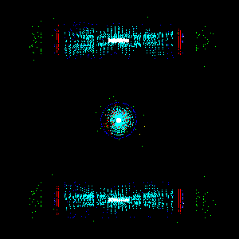

# HEP EventClassification

This repository contains code and step-by-step instructions to train neural
network on HEP images and perform Event Classification with them.

### HEP images
Here are few examples of HEP events from CMS detector. Each image represents an
event in XY, YZ, XZ views:



### Instructions
This repository contains:
<ol type="I">
    <b>
    <li> Dataset Organizer </li>
    <li> Data Normalization </li>
    <li> Neural Network Trainer & Analysis </li>
    </b>
</ol>

<h3> I. Dataset Organizer </h3>

We organize a dataset into training, validation, and testing set (skip if your data is already split as such). The following data structure is expected:
```
data
├── higgs
├── jpsi
├── qcd
└── etc
    └── event.png
```
The `dataset_organizer.py` script can be used to perform the split for us! For example, we could run the following command in the shell:
```
python dataset_organizer.py --PATH /path/to/unorganized/dataset/ --train_percent .6 --valid_percent .2 --test_percent .2 --categories RelValHiggs200ChargedTaus_13 other
```
dataset_organizer.py has the following arguments: 
```
Args:
        PATH (str) - path to folder with unorganized dataset
        train_percent (int) - percentage of data to allocate to training set
        valid_percent (int) - percentage of data to allocate to validaiton set
        test_percent (int) - percentage of data to allocate to testing set
        balanced (flag) - optional, whether to make dataset balanced with equal number of samples in each class
        delete_excess (flag) - optional, whether to delete class folders after moving necessary files
        categories (n strings) - optional, strings of folder names we will consider as a class when organizig data. If not included, every folder name will be considered a class we organize. If included, folders named will be considered a class we organize; folders not named will be put into "other" if "other" is named, or just ignored  
```

<h3> II. Data Normalization </h3>

After organizing the data set, we need to know the mean and standard deviations for the RGB color channels of our dataset. 
We can use compute_normalization.py for this task! compute_normalization.py will print the means and stdevs for us in the terminal. For example, we could run the following command in the shell:
```
python compute_normalization.py --PATH /path/to/organized/dataset/ --shape 224 
```
compute_normalizations.py has the following arguments:
```
Args:
        PATH (str) - path to folder with data organized into training, validation, testing
        shape (int) - height in pixels for resizing square image. If we don't wish to resize our image, just input original height of image
        bs (int, default:1) - batch size for these computations
        max_samples (int, default:inf) - optional, max number of samples to consider when computing mean & stdev. If dataset is too large to compute in it's entirety, we can pass a maximum number of samples to consider to get an accurate estimation of the mean & stdevs
```
compute_normalization.py will print out the means and the standard deviations, 

<h3>III. Neural Network Trainer & Analysis</h3>

Now that we have the means and std devs, we can pass them on to train.py, where we will train a Densely Connected 161 layer Neural Network using the ADAM optimizer, report the training behavior of the neural net, a ROC Curve, and a Confusion Matrix. We can even distribute our computing amongst many GPU's! To do so, we run the following command:

```
python train.py --PATH_data /path/to/organized/dataset/ --PATH_save_images /path/to/save/analysis/report/ --means 0.002886 0.015588 0.016239 --stdevs 0.052924 0.123025 0.125617 --fc_features 19872 --gpus 0 1 2
```

train.py run configurations 
```
Args:
        bs (int, default:32) - batch size 
        epcohs_last_layer (int, default:2) - # of epochs to train only the fully connected layer of net
        epochs (int, default:10) - # of epochs to train whole neural network
        shape (int) - optional, height in pixels for resizing square image
        lr (float, default:1e-4) - learning late for ADAM optimizer
        betas (2 floats, default: .9 .999) - betas for ADAM optimizer
        weight_decay (float, default: 0) - weight decay for updating weights
        eps (float, default:1e-8) - epsilon term added learning rate denominator for numerical stability
        dropout (float, default:0) - drop out rate for dropout layers of network
        means (3 floats) - mean pixel values for R,G, & B color channels
        stdevs (3 floats) - std dev pixel values for R,G, & B color channels
        fc_features (int) - number of features extracted from image by network that's fed to fully connected layer. Use 2208 for 224x224 images, Use 317952 for 600x600 images
        pretrained (flag) - optional, designates if we should start with Imagenet pretrained weights before training
        PATH_model_save (str) - optional, designates folder to save model if you wish to save your model after training it
        PATH_data (str) - path for accessing data folder
        PATH_save_images (str) - path to save images of our analysis  
        gpus (n ints,default:0) - ID's of gpus, starting from 0 to 7
```
<b><u>NOTE:</u></b> <br>
A crucial but tricky parameter to set is fc_features. It's possible to compute manually, but it's quite difficult with such a large Neural Network. Instead, we can run train.py with fc_features set to some arbitrary integer > 0 and discover the right value in an error. Suppose my setting is --fc_features 2208. This will lead to an error like this:
```
RuntimeError: size mismatch, m1: [4 x 19872], m2: [2208 x 3] at /opt/conda/conda-bld/pytorch_1524586445097/work/aten/src/THC/generic/THCTensorMathBlas.cu:249
```
Which communicates to us that the correct setting is --fc_features 19872.

### Training on TPUs
Here is brief instructions how to train on TPUs. In order to train on TPUs we
transform our image dataset into TFRecords using `img2tfrecs.py` script, e.g.
```
./img2tfrecs.py --fdir=<image_dir> --image-shape=300,300,3 --classes=2 --fout=tfrecord --nfiles=1000
```
The script expects from end-user an image directory, the image shape (default
is 300x300x3, i.e. png image), specify number of classes, and how many
images to pack into single tfrecord file.

Then the tfrecord files should be moved to Google storage and we can perform
training as following:
```
./keras_dn.py --fdir=tfrecords300 --classes=2 --epochs=1 --dropout=0.5 --fout=keras --batch_size=20 --steps=1000
```
